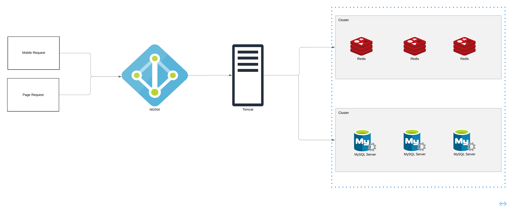

# TripAdvisor Backend App

This project is a backend application mimicking some functionalities of **TripAdvisor**. It is developed as part of my learning journey to better understand and implement **Redis** in a real-world application. The app handles key business logic and provides API endpoints for a variety of actions related to users, shops, vouchers, and more.

## Purpose

The goal of this project is to:
- Understand and implement Redis for caching and database optimization.
- Simulate a backend system similar to **TripAdvisor**.
- Learn how to design a backend system with real-world data models.

## General Framework Diagram

## Features

The backend app includes several advanced Redis-based features such as:

- **SMS Login**: Redis shared session management.
- **Merchant Query Cache**: Caching merchant data.
- **Enterprise Cache Techniques**: Solutions for cache avalanche and penetration.
- **Coupon Seckill**: High-concurrency coupon system.
- **Redis Counters & Lua Scripts**: Atomic counters and Lua scripting.
- **Distributed Locks**: Redis-based distributed locking.
- **Redis Message Queues**: Three types of Redis message queues.
- **Nearby Merchants**: Redis GeoHash for location-based queries.
- **Black Horse Review**: Review system with Redis.
- **Influencer Shop Reviews**: User blogs for merchant reviews.
- **Like Lists**: Redis List-based like tracking.
- **Leaderboard**: Redis SortedSet for ranking.
- **Friend Follow System**: Redis Set for follow/unfollow and notifications.
- **User Check-ins**: Redis Bitmap for check-in tracking.
- **UV Statistics**: Redis HyperLogLog for unique visitor counting.

## Database Tables

The project uses the following tables:

- **tb_user**: User table for storing basic user information.
- **tb_user_info**: Stores additional user details, such as profile information.
- **tb_shop**: Stores shop information, including details about different merchants.
- **tb_shop_type**: Categorizes different types of shops.
- **tb_blog**: Users can post blogs or reviews, with this table storing blog entries.
- **tb_follow**: Tracks user follow relationships, allowing users to follow other users or shops.
- **tb_voucher**: Contains information about available discount coupons.
- **tb_voucher_order**: Stores orders related to vouchers, tracking user redemptions.

## Technologies Used

- **Java**: Programming language used to build the application.
- **Spring Boot**: Framework for creating the backend application.
- **Redis**: Used for caching and optimizing performance.
- **MySQL**: Relational database to store persistent data.
- **Redisson**: Redis client for Java, used for distributed data structures and services.

## Flash sale feature analysis

### Background
Currently, the system has implemented the functionality for **one voucher per user** and **inventory checks for flash sale vouchers**.

### Current Business Logic Flow
The current process for handling a flash sale is as follows:
1. Query the voucher and render it on the frontend.
2. Check the inventory for the flash sale voucher.
3. Query the user's orders to prevent multiple orders for the same user.
4. Validate the one-voucher-per-user rule.
5. Reduce the inventory.
6. Complete the order.

### Optimization Approach
To improve the speed of the entire process, we plan to decompose the operations and introduce **read-write separation**. This will allow for better performance and quicker response times. Specifically:
- Operations 2 (inventory check) and 4 (one-voucher validation) will be handled by Redis caching, allowing these checks to be faster.
- Operations 1, 3, 5, and 6 will be processed only after operations 2 and 4 are successfully validated in the cache. The operations will first perform read actions, and if successful, the write actions will be executed afterward.

### Optimized Flow
After optimization, the flow will be as follows:
1. Redis will perform operations 2 (inventory check) and 4 (one-voucher validation).
2. Upon successful validation, the `voucher_id`, `user_id`, and `order_id` will be pushed to a message queue.
3. The message queue will return the `order_id` to the user.
4. Operations 1, 3, 5, and 6 will be executed asynchronously.
5. Finally, the queue will be asynchronously read to complete the order.
